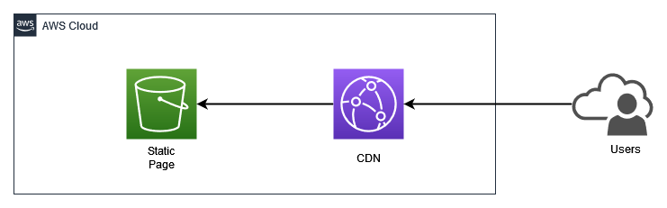

# Deploy Static Site in S3 and CloudFront using CDK

## Overview Architecture

  

This project create the infrastructure for static site, which uses an S3 bucket for storing content and CloudFront as CDN. The site contents located in `/website` folder. It support HTTPS redirection, so when users access static site, it will automatically redirect to HTTPS.

  

## Outputs

- `SyntheticodeStack.CDNDomainName` = Public hostname of CloudFront

 

## Useful commands

- `npm run build` compile typescript to js
- `npm run watch` watch for changes and compile
- `npm run test` perform the jest unit tests
- `cdk deploy` deploy this stack to your default AWS account/region
- `cdk diff` compare deployed stack with current state
- `cdk synth` emits the synthesized CloudFormation template
- `cdk destroy` delete all project resources
