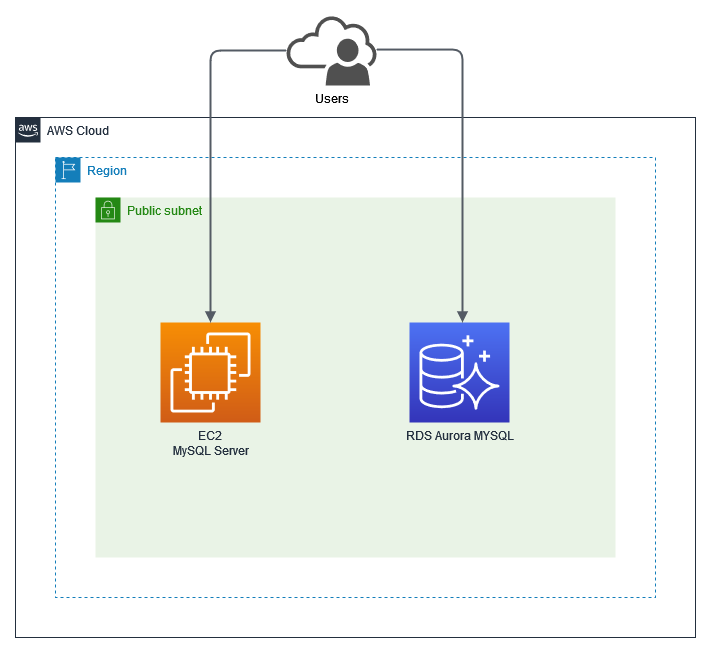

# Create EC2 Web Server using CDK

## Overview Architecture

<p align="center">
  
</p>

This project used to simulate database migration using [AWS DMS](https://docs.aws.amazon.com/dms/latest/userguide/Welcome.html). Some of the resources created are RDS Aurora for MySQL and an EC2 instance that have installed mysql server, both resources are publicly accessible.

> Please note that the source code here is only used for experimental purposes. Never use it for dev or production.

</br>

## Outputs

- `SyntheticodeStack.DownloadKeypaircommand` = The command needed to Download the private key that was created.
- `SyntheticodeStack.IPAddress` = Public IP Address of instance.
- `SyntheticodeStack.SSHCommand` = The command used to connect to the instance.
- `SyntheticodeStack.DBClusterEndpoint` = RDS endpoint and port.
- `SyntheticodeStack.DBSecretName` = Secret Name that store user auth for RDS.
- `SyntheticodeStack.DBGetAuth` = The command used to retrieve user auth.

</br>

## How to access the Instance

To connect the instance:

1. Download the private key from AWS Secrets Manager using [AWS CLI](https://docs.aws.amazon.com/cli/latest/userguide/cli-chap-welcome.html):

   ```bash
   aws secretsmanager get-secret-value \
   --secret-id ec2-ssh-key/keypair-anak-magang/private \
   --query SecretString \
   --output text > cdk-key.pem && chmod 400 cdk-key.pem
   ```

2. SSH to the instance using public IP Address from stack's output `SyntheticodeStack.IPAddress`.

   ```bash
   $ ssh -i cdk-key.pem ec2-user@<ip-address-instance>

   # For example
   $ ssh -i cdk-key.pem ec2-user@11.11.11.11
   ```

   </br>

## How to access RDS Database

To connect RDS database:

1. Get secret name from stack's output `SyntheticodeStack.DBSecretName`.

2. Retrieve database authentication such as username, password, hostname and port using [AWS CLI](https://docs.aws.amazon.com/cli/latest/userguide/cli-chap-welcome.html), for `--secret-id` value, use `SyntheticodeStack.DBSecretName`.

   ```bash
   aws secretsmanager get-secret-value \
    --secret-id your-secret-key-from-stacks-output \
    --output json > dbAuthInfo.txt

    # For example
   aws secretsmanager get-secret-value \
    --secret-id DMSSecret \
    --output json > dbAuthInfo.txt
   ```

3. Connect to database using authentication which has been saved in `dbAuthInfo.txt` using this command:

   ```bash
   mysql -h <host> -P <port> -u <username> -p <password>
   ```

   </br>

## Useful commands

- `npm run build` compile typescript to js
- `npm run watch` watch for changes and compile
- `npm run test` perform the jest unit tests
- `cdk deploy` deploy this stack to your default AWS account/region
- `cdk diff` compare deployed stack with current state
- `cdk synth` emits the synthesized CloudFormation template
- `cdk destroy` delete all project resources
