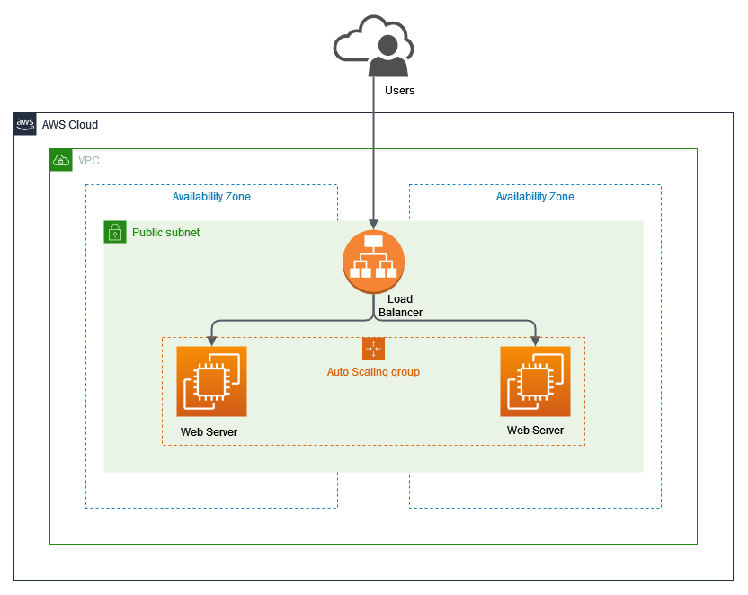

# Create Application Load Balancer using CDK

## Overview Architecture

  

This project creates:

- A new VPC
- public subnet each AZ's
- Application Load Balancer that open for public
- Auto scaling that have minimum two instance that running web server using nginx
- Setup web server and deploy a dummy PHP app using custom [user data](https://docs.aws.amazon.com/AWSEC2/latest/UserGuide/user-data.html) that stored in `user-data/setup.sh`

 

## Outputs

- `SyntheticodeStack.ALBEndpoint` = DNS name / HTTP Endpoint of this ALB.

 

## Useful commands

- `npm run build` compile typescript to js
- `npm run watch` watch for changes and compile
- `npm run test` perform the jest unit tests
- `cdk deploy` deploy this stack to your default AWS account/region
- `cdk diff` compare deployed stack with current state
- `cdk synth` emits the synthesized CloudFormation template
- `cdk destroy` delete all project resources
