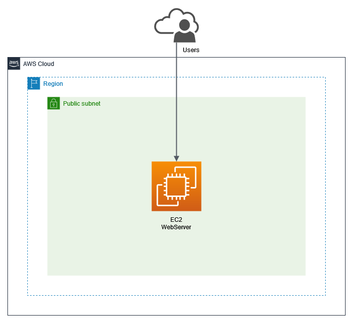

# Create EC2 Web Server using CDK

## Overview Architecture

<p align="center">
  
</p>

This project creates:

- A new VPC
- One public Subnet
- A security group
- An EC2 instance that running web server using nginx
- Setup web server and deploy an App using custom [user data](https://docs.aws.amazon.com/AWSEC2/latest/UserGuide/user-data.html) that stored in `user-data/setup.sh`

</br>

## Outputs

- `SyntheticodeStack.DownloadKeypaircommand` = The command needed to Download the private key that was created.
- `SyntheticodeStack.IPAddress` = Public IP Address of instance.
- `SyntheticodeStack.SSHCommand` = The command used to connect to the instance.

</br>

## How to access the Instance

To connect the instance:

1. Download the private key from AWS Secrets Manager using [AWS CLI](https://docs.aws.amazon.com/cli/latest/userguide/cli-chap-welcome.html):

   ```bash
   aws secretsmanager get-secret-value \
   --secret-id ec2-ssh-key/keypair-anak-magang/private \
   --query SecretString \
   --output text > cdk-key.pem && chmod 400 cdk-key.pem
   ```

2. SSH to the instance using public IP Address from stack's output `SyntheticodeStack.IPAddress`.

   ```bash
   $ ssh -i cdk-key.pem ec2-user@<ip-address-instance>

   # For example
   $ ssh -i cdk-key.pem ec2-user@11.11.11.11
   ```

</br>

## Useful commands

- `npm run build` compile typescript to js
- `npm run watch` watch for changes and compile
- `npm run test` perform the jest unit tests
- `cdk deploy` deploy this stack to your default AWS account/region
- `cdk diff` compare deployed stack with current state
- `cdk synth` emits the synthesized CloudFormation template
- `cdk destroy` delete all project resources
